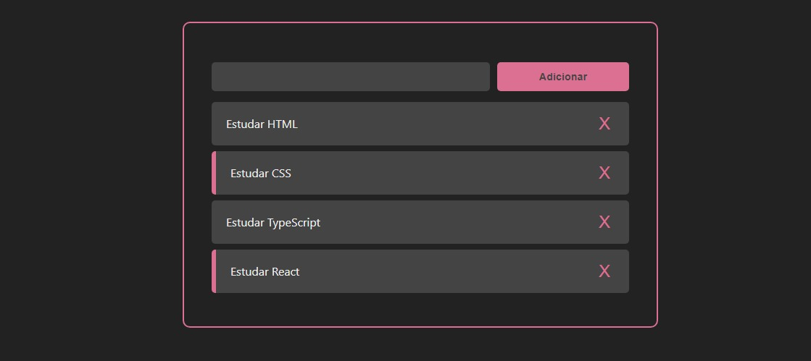

# Lista de tarefas

> Primeiro projeto criado com React.js para consolidar conhecimentos adquirido no curso de formação do estágio que participo.

## 💻 Tecnologias
Este projeto foi desenvolvido com as seguintes tecnologias:

* HTML
* CSS
* JAVASCRIPT
* REACT.JS

## ☕ Como utilizar
Clique nas tarefas já registradas para marcar ou desmarcar a conclusão.  
Registre uma nova tarefa preenchendo o campo de texto e clicando no botão "Adicionar".  
Delete uma tarefa clicando no botão "X" que se econtra na lateral direita de cada tarefa.  
Você pode acessar o projeto [clicando aqui](http://lista-tarefas-react-beryl.vercel.app/).
